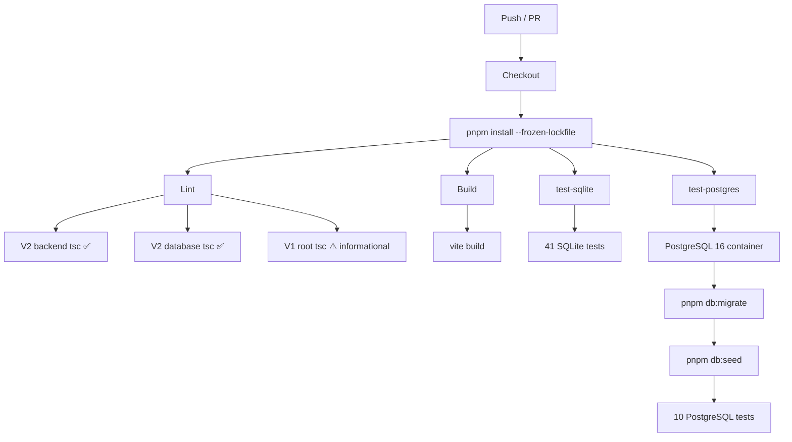

# MinaMatch V2 — CI/CD Pipeline

## Pipeline Overview

The CI pipeline runs on every push and pull request to `version-2` and `main`. It consists of **4 jobs** that execute in parallel after dependency installation:

| Job | Purpose | Can fail CI? |
|-----|---------|:---:|
| `lint` | TypeScript type checks (V2 strict, V1 informational) | ✅ |
| `build` | Vite production build (V1 frontend) | ✅ |
| `test-sqlite` | SQLite integration tests (offline, without external DB) | ✅ |
| `test-postgres` | PostgreSQL integration tests (with CI service container) | ✅ |

No job depends on another — all start simultaneously. If any job fails, the pipeline is marked red.

## How it works

### Dependencies
```yaml
- uses: pnpm/action-setup@v4
- uses: actions/setup-node@v4
  with:
    node-version: '22'
    cache: 'pnpm'
- run: pnpm install --frozen-lockfile
```

Each job runs its own `pnpm install` with `--frozen-lockfile` (the lockfile **must** be up to date). The `cache: pnpm` option makes `setup-node` automatically restore/save `~/.local/share/pnpm/store`, so subsequent runs are much faster.

### Lint (lint)
```yaml
npx tsc --noEmit --project packages/backend/tsconfig.json   # V2 backend — 0 errors required
npx tsc --noEmit --project packages/database/tsconfig.json   # V2 database — 0 errors required
npx tsc --noEmit                                              # V1 root — informational, continues on error
```

V2 type checks are **strict**: 0 errors required. The V1 root check runs with `continue-on-error: true` because of 3 pre-existing errors in `LandingPage.tsx` (lines 223, 259, 886) that are unrelated to V2.

### Build (build)
```yaml
pnpm run build  # vite build (V1 frontend)
```

Ensures V1 still compiles. No V2 packages need a build step (they run as raw TypeScript via `tsx`/`vitest`).

### SQLite tests (test-sqlite)
```yaml
pnpm --filter @minamatch/backend test:sqlite
```

Runs all `*.test.ts` files with `DATABASE_PROVIDER=sqlite` (set in `vitest.config.ts`). Uses the committed `data/minamatch.db` file — no external database required.

On failure, test outputs are uploaded as a GitHub Actions Artifact (retained 7 days).

### PostgreSQL tests (test-postgres)
```yaml
services:
  postgres:
    image: postgres:16
    env:
      POSTGRES_USER: minamatch
      POSTGRES_PASSWORD: minamatch_dev
      POSTGRES_DB: minamatch_v2
```

GitHub Actions spins up a **service container** running PostgreSQL 16 alongside the job. The service is configured with a health check (`pg_isready`) and retries before the job steps begin.

Steps after the service is ready:
1. `pnpm db:migrate` — applies Drizzle migrations to create the schema
2. `pnpm db:seed` — populates tables with development seed data
3. `pnpm --filter @minamatch/backend test:postgres` — runs `simple.routes.postgres.test.ts` against the container

The PostgreSQL tests are **non‑blocking** — if the service doesn't start, they skip silently via a TCP port check in the test file.

## Visual summary



## Test counts

| Suite | Provider | Tests | Depends on |
|-------|----------|-------|------------|
| SQLite | better-sqlite3 (committed DB) | 41 | Nothing |
| PostgreSQL | Drizzle ORM + postgres.js | 10 | PostgreSQL service container |
| **Total** | — | **51** | — |

## What's NOT in this pipeline (yet)

- **Deploy** — no automatic Railway / cloud deploy. This pipeline only validates.
- **E2E tests** — no browser or API end-to-end tests.
- **Coverage** — no code coverage threshold or upload.
- **Docker image** — no container build or registry push.
- **PostgreSQL seed step** — the seed runs each time; could be optimized with a pre-seeded image.
